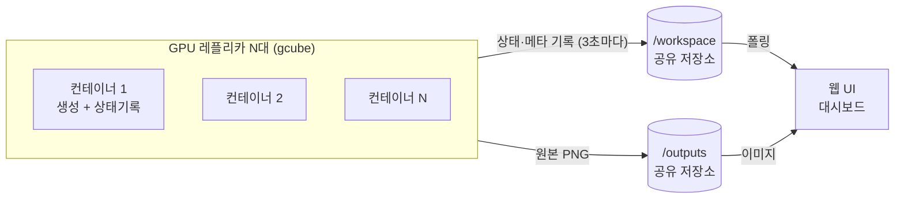

# zimage-auto-light

- gcube GPU 클라우드에 **Z-Image-Turbo(uint4)** 를 분산 배포해 이미지를 대량 생성하는 **REST API + 모니터링 웹 UI**
- 여러 레플리카(GPU 노드 위 컨테이너)가 같은 워크로드로 떠서 각자 이미지를 생성하고, 공유 저장소에 결과·상태를 남김
- 웹 UI는 그 공유 저장소를 읽어 전체 레플리카를 한 화면에 집계해 보여줌

## 사용 목적

- gcube에서 GPU 여러 대를 동시에 돌려 **이미지를 분산 생성**(예: 노드 100대 동시 데모)
- 생성 현황·자원·속도를 **웹 대시보드로 모니터링**
- 레플리카별 **일시중지 / 재개 / 취소** 제어

## 구조

```
zimage-auto-light/
├── server.py              # FastAPI 서버 — 생성 워커, 상태 기록, REST API
├── index.html             # 웹 UI (대시보드 + 생성 탭 + 사용설명)
├── static/
│   ├── app.js             # UI 로직 (폴링·렌더링·제어)
│   ├── style.css          # 다크 퍼플 테마
│   └── logo.png
├── conditions.json        # 자동 생성용 프롬프트/파라미터 목록 (100항목)
├── Dockerfile             # CUDA 12.8 + PyTorch cu128 + 모델 베이크
├── entrypoint.sh          # uvicorn 기동
├── requirements.txt
└── .github/workflows/
    └── build.yml          # ghcr 이미지 빌드/푸시
```

## 동작 개요



- 각 레플리카는 기동 시 모델을 GPU에 로드한 뒤, `conditions.json`을 순회하며 이미지를 생성
- 원본 PNG는 `/outputs`, 메타 json은 `/workspace`에 기록 (용량 중복 방지)
- 3초마다 heartbeat로 자기 상태(자원·진행·GPU 응답)를 `/workspace`에 갱신
- 웹 UI는 `/workspace`를 폴링해 전체 레플리카를 집계·표시
- 상태는 **실행 / 멈춤 / 지연 / 완료 / 죽음** 으로 구분
  - 지연 = 갱신이 잠깐 늦음(살아있음), 죽음 = 오래 응답 없음 — 깜빡임 방지 2단계 판정

## 클라우드 저장소 마운트 (필수)

- 레플리카가 여러 대여도 한 화면에서 모니터링되려면, **모든 레플리카가 같은 공유 저장소를 마운트**해야 함
- gcube 워크로드 설정에서 클라우드 저장소를 아래 두 경로에 마운트

| 마운트 경로 | 용도 |
|---|---|
| `/workspace` | 상태·메타·시계열 (UI가 읽는 곳) |
| `/outputs` | 생성된 원본 PNG (아카이브) |

- 두 경로를 마운트하지 않으면 레플리카 간 상태가 공유되지 않아 모니터링이 동작하지 않음

## 환경변수

### 필수 (자동 생성을 시작하려면)

| 변수 | 설명 |
|---|---|
| `GEN_COUNT` | 자동 생성할 이미지 장수. `CONDITIONS_FILE`과 함께 있어야 기동과 동시에 자동 생성 시작 |
| `CONDITIONS_FILE` | 생성 조건 파일 경로 (예: `/workspace/conditions.json`) |

- 두 변수가 없으면 자동 생성은 시작되지 않고, 웹 UI의 수동 생성만 가능

### 선택

| 변수 | 기본 | 설명 |
|---|---|---|
| `RUN_ID` | 자동(파드명 기반) | 실행(회차) 식별자. 회차를 구분하려면 지정 (예: `demo-0601-1`) |
| `RANDOM_PICK` | false | 조건을 순서대로가 아니라 무작위로 뽑을지 |
| `STALE_SECONDS` | 120 | 이 시간 갱신 없으면 '지연'(주황) |
| `DEAD_SECONDS` | 300 | 이 시간 갱신 없으면 '죽음'(빨강) |
| `LOAD_STALE_SECONDS` | 600 | 모델 로드 중(loading) 전용 죽음 임계 |
| `HEARTBEAT_SEC` | 3 | 상태 갱신 주기(초) |
| `ZIMG_WIDTH` / `ZIMG_HEIGHT` | 1024 | 기본 해상도 |
| `ZIMG_STEPS` | 8 | 기본 스텝 |
| `ZIMG_GUIDANCE` | 0.0 | 기본 guidance |
| `WORK_DIR` / `OUTPUT_DIR` | /workspace, /outputs | 마운트 경로를 바꿀 때만 |

## 주요 API

| 메서드 | 경로 | 설명 |
|---|---|---|
| GET | `/` | 웹 UI |
| GET | `/api/status` | 자기 레플리카 상태 |
| GET | `/api/replicas_all` | 전체 레플리카 집계 |
| GET | `/api/resources` | 자원·생성 속도 |
| GET | `/api/images` | 이미지 목록(최근순, replica·source 필터) |
| GET | `/api/images/{id}/file` | 이미지 원본 |
| POST | `/api/generate` | 수동 1장 생성 |
| POST | `/api/job/{start,pause,resume,cancel}` | 자동 생성 잡 제어 |
| POST | `/api/control` | 대상 레플리카에 제어 명령 전달 |